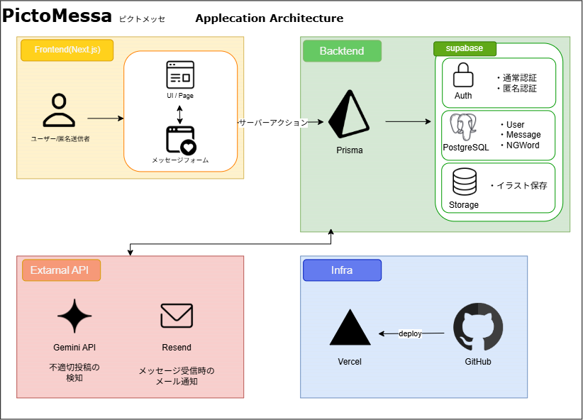
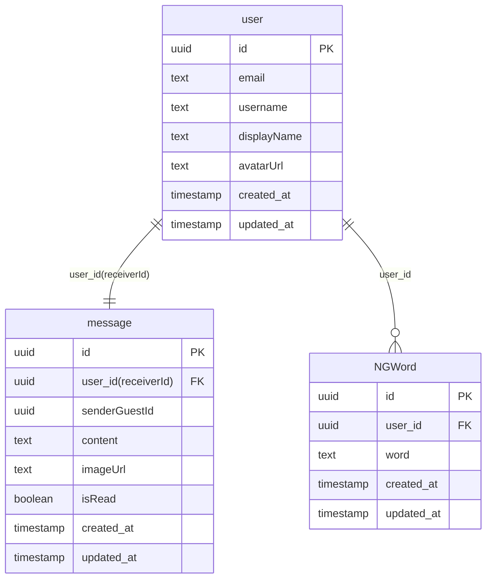

# PictoMessa 💕🖊
クリエイター向け匿名メッセージ受付アプリ


## デモ
- **URL:** https://picture-message-gamma.vercel.app
- **メールアドレス:** test@sample.com
- **パスワード:** test1234

⚠️デモアカウントは共有です。個人情報を入力しないでください。


- **メッセージ送信URL:** https://picture-message-gamma.vercel.app/u/test_1234

※ログインなしでメッセージやイラストの送信ができます。

⚠️送信したメッセージはデモアカウントに送信されます。個人情報の入力や誹謗中傷など送信しないでください。


## 概要
クリエイター向けの匿名メッセージ受付アプリです。
クリエイターにむけて自分の名前を出さずに、感想やイラストを送信できます。

言葉だけでは言い表せない素敵な想いをPictoMessaで届けましょう。

### ターゲット
- SNSで創作活動をしている人
- クリエイターに感想を送りたいけど、直接送るのは恥ずかしい人
- メッセージを送るのに、文章を考えるのが苦手で上手くまとまらない人

### 課題
- クリエイターへ認知されるのは恥ずかしいので感想が送れない。
- SNSで特定の人にリプライでイラストを送っても、無関係の人にもいいねされてしまい、通知の巻き込みになり不便
- SNSでイラストを送るとき、無許可で他人の書いたイラストを使用されてしまう。
- マシュマロやwaveboxでは、AI検知だけでは防げない自分が苦手な単語も受信してしまう。

### 解決策
- 匿名機能を実装することで、ログインなしでメッセージを送信できる。
- メッセージ送信でキャンバス機能を実装することで、他者に見られず送信でき、受信者がSNSでメッセージを紹介するときも通知の巻き込みが起こらない。
- キャンバス機能の実装により、無断転載のリスクがなくなる。
- AI検知以外に、自分の苦手な単語としてNGワードに登録し、NGワードが含まれたメッセージを拒否する。

---
## 機能
- **認証:** メールアドレス・パスワードでログイン
- **マイページ:**　プロフィール情報の確認・メッセージ受付URLのコピー・ログアウト
- **受信箱:** 受信メッセージの一覧・詳細取得・メッセージ画像のダウンロード・メッセージの削除
- **設定:** [名前・プロフィール画像・ユーザーID・メールアドレス・パスワード]の変更・NGワードの設定

- **メッセージ送信画面:** メッセージの入力・キャンバス描画

---
## アーキテクチャ図




---
## ER図



---

## 技術スタック
| カテゴリ | 技術 |
| --- | --- |
| フロントエンド | Next.js 16 / TypeScript / Tailwind CSS v4 |
| バックエンド | Supabase（Auth・DB・Storage）/ Prisma ORM |
| AI | Gemini API（gemini-3.6-flash） |
| デプロイ | Vercel |

---
## 外部API
| API | 用途 |
| --- | --- |
| Supabase Auth | メール・パスワード認証 |
| Supabase Storage | プロフィール画像・イラストの保存 |
| Gemini API | 不適切投稿の検知 |
| Resend | メッセージ通知メール受信 |

---
## ローカル開発
```bash
git clone https://github.com/risenagata/picture-message.git
cd picture-message
npm install

```
`.env`を作成して以下の環境変数を設定してください
```bash
NEXT_PUBLIC_SUPABASE_URL=
NEXT_PUBLIC_SUPABASE_ANON_KEY=
RESEND_API_KEY=
GEMINI_API_KEY=
NEXT_PUBLIC_APP_URL=

DATABASE_URL=
DIRECT_URL=
```
```bash
npx prisma generate
npm run dev
```
http://localhost:3000でアクセス


